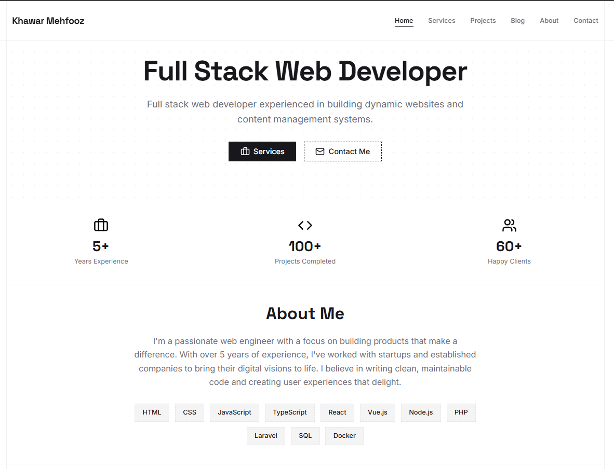

# Portfolio Theme

> A modern WordPress portfolio theme built with [Sage](https://roots.io/sage/), TailwindCSS, and Advanced Custom Fields (ACF). This theme is designed for showcasing projects, services, and client feedback with custom post types and relationships.



## Features

- Built on Sage 10 (WordPress starter theme with modern development workflow)
- TailwindCSS 4.0 for styling
- Advanced Custom Fields (ACF) for content management
- Three custom post types: Projects, Services, and Feedback
- Custom relationships between post types
- Custom ACF blocks for flexible page building
- Contact form with Cloudflare Turnstile captcha support
- Theme options page for easy configuration
- Modern development workflow with Vite

## Requirements

Before installing this theme, make sure you have:

- WordPress 6.6 or higher
- PHP 8.2 or higher
- [Composer](https://getcomposer.org/)
- [Node.js](https://nodejs.org/) 20.0.0 or higher
- [Advanced Custom Fields Pro](https://www.advancedcustomfields.com/pro/) plugin (required)

## Installation

### 1. Download the Theme

Download or clone this theme into your WordPress themes directory:

```bash
cd wp-content/themes
git clone https://github.com/KhawarMehfooz/wp-portfolio-theme.git
cd wp-portfolio-theme
```

### 2. Install PHP Dependencies

Install Composer dependencies:

```bash
composer install
```

### 3. Install Node Dependencies

Install npm packages:

```bash
npm install
```

### 4. Activate the Theme

1. Go to your WordPress admin panel
2. Navigate to **Appearance > Themes**
3. Activate **Portfolio Theme**

### 5. Install Advanced Custom Fields Pro

This theme requires ACF Pro to function properly. Make sure to install and activate it:

1. Install ACF Pro plugin
2. Activate it from the WordPress plugins page

## Setup

### Build Assets

For development, run the build process:

```bash
npm run dev
```

For production, build optimized assets:

```bash
npm run build
```

### Configure Theme Options

1. Go to **Theme Options** in your WordPress admin menu
2. Configure the following settings:
   - Archive page descriptions for Projects, Services, and Feedback
   - Contact form email settings (sender and receiver)
   - Cloudflare Turnstile captcha settings (optional)

### Create Content

The theme includes three custom post types:

1. **Projects** - Showcase your portfolio projects
2. **Services** - Display services you offer
3. **Feedback** - Collect and display client testimonials

## Custom Post Types

### Projects

Projects are the main portfolio items. Each project can have:

- Title and content
- Featured image
- Project date (ACF field)
- Related feedback (one feedback per project)
- Technology taxonomy
- Project category taxonomy

**Archive URL:** `/projects/`

### Services

Services represent the services you offer. Each service can have:

- Title and content
- Featured image
- Service icon (ACF image field)
- Related projects (up to 4 projects)
- Excerpt

**Archive URL:** `/services/`

### Feedback

Feedback items are client testimonials. Each feedback can have:

- Title
- Author name (ACF field)
- Author country (ACF field)
- Testimonial text (ACF field)

**Archive URL:** `/feedbacks/`

## Relationships

### Project → Feedback

Each project can have one related feedback. The feedback is displayed on the single project page.

**How it works:**
- When editing a project, you'll see an ACF relationship field
- Select one feedback item to link to the project
- The feedback will automatically display on the project's single page

### Service → Projects

Each service can have up to 4 related projects. These projects are displayed on the single service page.

**How it works:**
- When editing a service, you'll see an ACF relationship field
- Select up to 4 projects to link to the service
- The projects will automatically display on the service's single page

## Custom Blocks

The theme includes several custom ACF blocks:

- **Hero Block** - Full-width hero section
- **About Me Block** - About section
- **Stats Block** - Statistics display
- **Posts Block** - Display posts/projects/services
- **Feedback Block** - Showcase testimonials
- **Contact Form Block** - Contact form with AJAX submission

These blocks can be added to any page using the WordPress block editor.

## Development

### File Structure

```
wp-portfolio-theme/
├── app/
│   ├── Blocks/          # ACF block classes
│   ├── Fields/          # ACF field definitions
│   ├── Options/         # Theme options pages
│   ├── Providers/       # Service providers
│   └── View/            # View composers
├── config/              # Configuration files
├── resources/
│   ├── css/             # Stylesheets
│   ├── js/              # JavaScript files
│   └── views/           # Blade templates
└── public/              # Compiled assets
```

### Development Commands

```bash
# Start development server with hot reloading
npm run dev

# Build for production
npm run build
```

### Customizing Styles

Styles are located in `resources/css/app.css`. The theme uses TailwindCSS, so you can:

1. Add custom styles in `app.css`
2. Use Tailwind utility classes in templates
3. Configure Tailwind in `tailwind.config.js` (if needed)

### Customizing Templates

Templates use Blade syntax and are located in `resources/views/`. Key templates:

- `single-project.blade.php` - Single project page
- `single-service.blade.php` - Single service page
- `single-feedback.blade.php` - Single feedback page
- `archive-project.blade.php` - Projects archive
- `archive-service.blade.php` - Services archive
- `archive-feedback.blade.php` - Feedback archive

## Deployment

For deployment instructions, please refer to the [Sage documentation](https://roots.io/sage/docs/deployment/).

### Quick Deployment Steps

1. **Build production assets:**
   ```bash
   npm run build
   ```

2. **Install production dependencies:**
   ```bash
   composer install --optimize-autoloader --no-dev
   ```

3. **Upload to server:**
   - Upload the entire theme directory to your server
   - Make sure to exclude `node_modules` and `.git` directory

4. **Set permissions:**
   - Ensure proper file permissions on your server

5. **Activate theme:**
   - Go to WordPress admin and activate the theme

### Important Notes

- Always run `npm run build` before deploying to production
- Make sure ACF Pro is installed and activated on the production site
- Export ACF field groups if needed (or they will sync automatically)
- Check that all required PHP extensions are installed on the server

## Support

For issues related to:
- **Sage framework:** [Sage Documentation](https://roots.io/sage/docs/)
- **ACF:** [ACF Documentation](https://www.advancedcustomfields.com/resources/)
- **Theme-specific issues:** Please open an issue in the repository

## License

This theme is licensed under the MIT License.

---

## Author

**Khawar Mehfooz**

- Website: [https://khawarmehfooz.com/](https://khawarmehfooz.com/)

---

*This theme was built with ❤️ using Sage, TailwindCSS, and ACF.*
